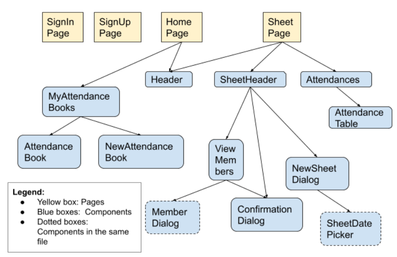

## Mock Ups

### Sign In Page

  
  

### Books

  
  

### Sheet

  
  

## Routing plan

  

## React Component Diagram

  

## Design consideration: Whether to use React framework Next.js

Benefits of using Next.js:
- Better performance, eg bundling, code splitting for faster page loads
  - Our attendance application handles a lot of data, and could benefit from the performance benefits of using Next.js.
- Search engine optimization
  - There's not a lot of content in our application, and growing the usage of our application is not really the main goal of our project.
- Server-side rendering, pre-rendering of pages
  - Can have performance benefits, but learning curve and short timeline for project likely doesn't justify the performance benefits
- Page based routing system
  - reported issues with dynamic routing, backend seems to want dynamic routing
- Built in CSS and Sass support

The benefits of using the Next.js framework doesn't outweigh the costs of using it, so I decided not to use it.

## Design consideration: Whether to use TypeScript with React for type checking

Benefits of using TypeScript:
- Can define prop types, reducing potential for bugs
- Better code completion with jsx and better intellisense, auto import
- More readable and confidence in code

Costs:
- Learning curve
- third party libraries might not support typescript
- Slightly longer compilation time
- Need to write more code

The benefits of using Typescript with React is also not significant enough, so I decided not to use it.

## URL Path Design

- Avoid adding data that are internal to the component and shouldn't be accessed from outside
- Places where users should start from the beginning

I think that attendance sheets should be able to be accessed from outside.

**(NOT SELECTED) Option 1:** `www.attendex.com/cs1010-tutorial/1-10-22` where `cs1010-tutorial` is the name of the attendance book, `1-10-22` is the date accessed. But when accessing such a page, we must make sure that the authentication token saved in the browser is valid, then we get the userid from the token and try and automatically load the specified attendance book and date. (Evaluation: It might be inefficient to be checking authentication first, then checking whether the specified attendance book and date exists)

**(SELECTED) Option 2:** `www.attendex.com/lily/cs1010-tutorial/1-10-22` where `lily` is the userid, `cs1010-tutorial` is the name of the attendance book, `1-10-22` is the date accessed. But when accessing such a page, we must make sure that the authentication token saved in the browser matches the userid before allowing access to the page. (Evaluation: Users usually know their userid, so it makes sense for them to be accessing this page from outside.)

Note for backend: auth token needs to contain userid

**(NOT SELECTED) Option 3:** `www.attendex.com/attendance-sheets` a generic, static path, where the data about which attendance book and date will be passed through other means. The problem with this approach is, when users try and access the attendance sheet from outside the website, there will probably be an error, since the data about which attendance sheet and which date isn't passed properly.

## Choice of design system: Material UI VS Chakra UI

UI component required | Material UI | Chakra UI
--- | --- | --- 
Form input (username, password, confirm password, text) | can do validation, have the basic form input boxes | I like how chakra ui has an editable component, that would be very useful, but we are not allowing people to edit the member names in this version, so i dont know how important that component would be. it has the basic input form boxes
Button | abit uglier because they capitalize the words by default | nicer buttons than material ui, can add icons and button loading state
Datepicker, select | Have datepicker (in mui lab) and nice dropdown | no built in datepicker, has basic dropdown
Tags (for member names) | called chips, has built in deletable prop | has tags and also built in deletable prop
Checkbox for attendance | have nice radio and checkboxes | have acceptable radio and checkboxes
Modal for forms | basic modal is a little ugly,, can consider using dialogs also | have nicer modals
Popup to instruct users to use the app | dont really have popup | can use tooltip for this
Table for attendance table | basic table looks okay, but need to style using styled function to customize color | seems similar to material ui table
Cards for attendance books | might be hard to use cards out of the box, might want to create own card component | doesn't have card component... :(
Header? | can use app bar | don't really have something i can use for header
Icons | has built in icons | also has built in icons

Why Material UI:
- It seems to be [easy to do color customization](https://medium.com/swlh/create-a-customized-color-theme-in-material-ui-7205163e541f) in material ui also, which is often troublesome with most UI libraries. 
- In general it seems that the material UI components come with more features compared to chakra UI. 

Why Chakra UI:
- Seems like Chakra UI can also do themes quite easily in a similar way as material ui, furthermore, chakra ui allows for [custom css to style the components, and allow css variables so we wont have to duplciate theme values](https://chakra-ui.com/docs/features/css-variables).
- Chakra seems to be more focused on creation of flexible, composable and scalable code
- Supposed to be easier to customize than material UI

**Final evaluation:** I think that chakra UI would be better for a project that has more focus on the UI design, where there is a set design, as chakra seems easier to manipulate and customize compared to material ui. Since that is not the main focus of this project, I chose to use material ui. Material UI also has more features for each component that we can make use of for our project.

## Best Practice: When to use functional components and class components in React

Use functional components when it doesn't need a state, use class when you need state. Use FC when they simply accept data and display them in some form (usually not interactive). But react hooks allow you to access state and all in functional components.

## Best practice (before react hooks): React render props pattern

Sharing code between react components using a prop whose value is a function.

Traditionally, if we have 2 components that are similar, we can abstract it out by abstracting common logic (like state and methods), and placing it into a wrapper component into the state. This is passing a react component into a wrapper component as a prop. We do this when we want to abstract out common logic (methods) and state from 2 components with different styling. (This is when we can't abstract out by changing the styling using props.)

[Video explaining render props pattern](https://www.youtube.com/watch?v=3IdCQ7QAs38)

## Best practice (before react hooks): Higher order component pattern

If we have multiple component doing the same logic (increment count method, and count variable in state), but have slightly different displays, `Hovered X times` vs `Clicked X times` then a lot of code duplication. If both components have same parent component, we can simply lift the state of count into parent, and pass the handlers as props. But if they have different parents, will have duplicate state and handlers everywhere still.

This one is basically adding a wrapper around the component which adds a specific function/feature to the original component. (eg. passing an additional prop) For reducing duplication, we would be putting the common logic into this higher order component. I think this is similar to react context, except that react context is for props and HOCs are for things like state and methods.

## Best practice: React context

Use react context to make a prop value available throughout everything wrapped within the context. (can use `useContext` hook to access it, in place of `Consumer` component)

## Best practice:

Use react hooks to abstract out common logic/state.

[Video explaining react hooks](https://www.youtube.com/watch?v=TNhaISOUy6Q)